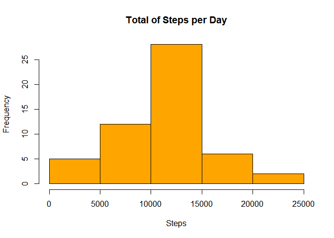
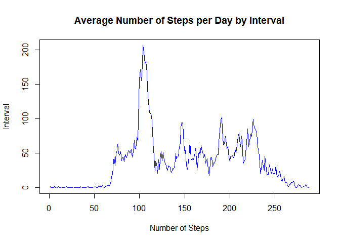
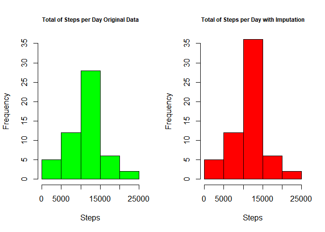
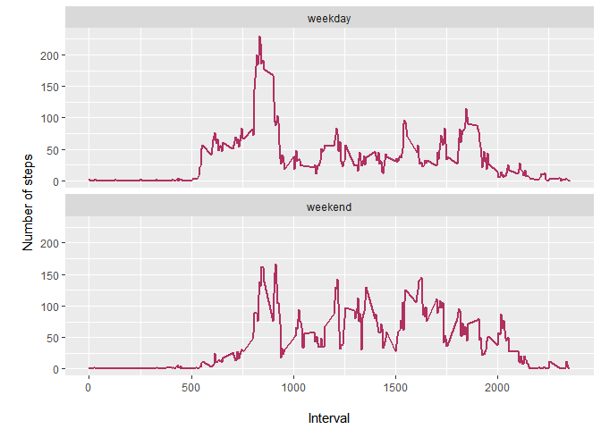

This assignment makes use of data from a personal activity monitoring device. This device collects data at 5 minute intervals through out the day. The data consists of two months of data from an anonymous individual collected during the months of October and November, 2012 and include the number of steps taken in 5 minute intervals each day.

<b>Data</b>

The data for this assignment is downloaded from the course website

 


The dataset is stored in a comma-separated-value (CSV) file and there are a total of 17,568 observations in this dataset.


```r
#Set your working directory
#setwd("~/GitHub/RepData_PeerAssessment1")

#Install and load the following packages

#install.packages("ggplot2")
#install.packages("dplyr")
#install.packages("chron") #Used for is.weekend() function
library (ggplot2)
```

```
## Warning: package 'ggplot2' was built under R version 3.4.3
```

```r
library (dplyr)
```

```
## Warning: package 'dplyr' was built under R version 3.4.3
```

```
## 
## Attaching package: 'dplyr'
```

```
## The following objects are masked from 'package:stats':
## 
##     filter, lag
```

```
## The following objects are masked from 'package:base':
## 
##     intersect, setdiff, setequal, union
```

```r
library (chron)
```
After installing the libraries, you will load the dataset 

1.  a. Load the dataset


```r
if(!file.exists("getdata-projectfiles-UCI HAR Dataset.zip")) {
  temp <- tempfile()
  download.file("http://d396qusza40orc.cloudfront.net/repdata%2Fdata%2Factivity.zip",temp)
  unzip(temp)
  unlink(temp)
}

data <- read.csv("activity.csv")
```
    b. Process and transform the data
  
  ```r
  head(data)
  ```
  
  ```
  ##   steps       date interval
  ## 1    NA 2012-10-01        0
  ## 2    NA 2012-10-01        5
  ## 3    NA 2012-10-01       10
  ## 4    NA 2012-10-01       15
  ## 5    NA 2012-10-01       20
  ## 6    NA 2012-10-01       25
  ```
Note that there are three variables included in this dataset:

    steps: Number of steps taking in a 5-minute interval (missing values are coded as NA)

    date: The date on which the measurement was taken in YYYY-MM-DD format

    interval: Identifier for the 5-minute interval in which measurement was taken
    
It is not necessary to make any transformations of the data at this time.

2. What is the mean total of steps taken each day? 
    a. Create a histogram to represent this data.


```r
# aggregate the data by date and sum the steps
steps_day <- aggregate(steps ~ date, data, sum)
head(steps_day)
```

```
##         date steps
## 1 2012-10-02   126
## 2 2012-10-03 11352
## 3 2012-10-04 12116
## 4 2012-10-05 13294
## 5 2012-10-06 15420
## 6 2012-10-07 11015
```

```r
# create the histogram using hist() command
hist(steps_day$steps, main = paste("Total of Steps per Day"), col = "orange", xlab = "Steps", ylab = "Frequency")
```

<!-- -->
    b. Calculate the mean and median of the number of steps per day.


```r
stepmean <- mean(steps_day$steps)
stepmedian <- median(steps_day$steps)
#The Mean of the steps per day is
stepmean
```

```
## [1] 10766.19
```

```r
#The Median of the steps per day is
stepmedian
```

```
## [1] 10765
```

3. What is the average daily activity pattern? 
    a. Make a time series plot (i.e. type = "l") of the 5-minute interval (x-axis) and the average number of steps taken, averaged across all days (y-axis)


```r
#aggregate the steps per interval and take the mean
steps_by_interval <- aggregate(steps ~ interval, data, mean)
#create the plot using plot() using Base Plotting
plot(steps_by_interval$steps, type = "l", lwd = 1.25, col = "blue", main = "Average Number of Steps per Day by Interval", xlab = "Number of Steps", ylab = "Interval" )
```

<!-- -->
    b.  Which 5-minute interval, on average across all the days in the dataset, contains the maximum number of steps?


```r
#The following reviews all intervals to determine which interval has the most steps
maxsteps <- steps_by_interval[which.max(steps_by_interval$steps), 1]
maxsteps
```

```
## [1] 835
```

4.  Imputing missing values (There are a number of records in which data on steps is missing (NA).  These NA values can create bias within the data.
    a.  Calculate and report the total number of missing values in the dataset (i.e. the total number of rows with NAs)

```r
total_NA <- is.na(data$steps) 
table(is.na(data$steps))
```

```
## 
## FALSE  TRUE 
## 15264  2304
```

```r
#Let's just see the number of rows which have NAs (results = TRUE)
sum(total_NA)
```

```
## [1] 2304
```
  b.  Devise a strategy for filling in all of the missing values in the dataset. The strategy does not need to be sophisticated. For example, you could use the       mean/median for that day, or the mean for that 5-minute interval, etc.
  c.  Create a new dataset that is equal to the original dataset but with the missing data filled in.

```r
#In this instance we will use the steps per interval data already calculated to fill in the gaps in the dataset
#First, we will merge the initial data set (data) with the already calculated the total steps per interval, creating a new dataset datanew
datanew <- merge(x=data, y=steps_by_interval, by = "interval")
#What does it look like now?
head(datanew)
```

```
##   interval steps.x       date  steps.y
## 1        0      NA 2012-10-01 1.716981
## 2        0       0 2012-11-23 1.716981
## 3        0       0 2012-10-28 1.716981
## 4        0       0 2012-11-06 1.716981
## 5        0       0 2012-11-24 1.716981
## 6        0       0 2012-11-15 1.716981
```

```r
#Then we create an additional steps field and fill in the steps that are missing with the calculated average
datanew$steps <- (ifelse(is.na(datanew$steps.x), datanew$steps.y, datanew$steps.x))
#Now, what does it look like?
head(datanew)
```

```
##   interval steps.x       date  steps.y    steps
## 1        0      NA 2012-10-01 1.716981 1.716981
## 2        0       0 2012-11-23 1.716981 0.000000
## 3        0       0 2012-10-28 1.716981 0.000000
## 4        0       0 2012-11-06 1.716981 0.000000
## 5        0       0 2012-11-24 1.716981 0.000000
## 6        0       0 2012-11-15 1.716981 0.000000
```

```r
#Let's clean it up a bit
datanew <- select(datanew, interval, date, steps)
#Final view of the new dataset
head(datanew)
```

```
##   interval       date    steps
## 1        0 2012-10-01 1.716981
## 2        0 2012-11-23 0.000000
## 3        0 2012-10-28 0.000000
## 4        0 2012-11-06 0.000000
## 5        0 2012-11-24 0.000000
## 6        0 2012-11-15 0.000000
```
  d.  Make a histogram of the total number of steps taken each day 
  

```r
#We have already calculated the sum of the steps per day in the original set, so we will repeat the process with the new dataset.
datanew_steps_day <- aggregate(steps ~ date, datanew, sum)
#Are we sure, let's see it
head(datanew_steps_day)
```

```
##         date    steps
## 1 2012-10-01 10766.19
## 2 2012-10-02   126.00
## 3 2012-10-03 11352.00
## 4 2012-10-04 12116.00
## 5 2012-10-05 13294.00
## 6 2012-10-06 15420.00
```

```r
#Now we will make two columns to hold 2 histograms (I preferred to look at two separate histograms)
par(mfrow=c(1,2))
#Makin an original and a new histogram
hist(steps_day$steps, main = paste("Total of Steps per Day Original Data"), cex.main = 0.75,  ylim = c(0,35), col = "green", xlab = "Steps", ylab = "Frequency")
hist(datanew_steps_day$steps, main = paste("Total of Steps per Day with Imputation"), cex.main = 0.75, ylim = c(0,35), col = "red", xlab = "Steps", ylab = "Frequency")
```

<!-- -->

```r
#resetting the frame for future activities
par(mfrow=c(1,1))
```
You can see that the imputation has made a signficant difference in the number of total steps.

  d.2. Calculate and report the mean and median total number of steps taken per day. Do these values differ from the estimates from the first part of the assignment? What is the impact of imputing missing data on the estimates of the total daily number of steps?

```r
#Calculating the mean and median of the steps for the new dataset

datanew_stepmean <- mean(datanew_steps_day$steps)
datanew_stepmedian <- median(datanew_steps_day$steps)

#Calculating and printing to screen the differences between the means and medians of both datasets
paste("New Mean      :", round(datanew_stepmean,2), "," ,  
      " Original Mean :", round(stepmean,2),"," , 
      " Difference :",round(datanew_stepmean - stepmean,2))
```

```
## [1] "New Mean      : 10766.19 ,  Original Mean : 10766.19 ,  Difference : 0"
```

```r
paste("New Median      :", round(datanew_stepmedian,2), "," ,  
      " Original Median:", round(stepmedian,2),"," , 
      " Difference :",round(datanew_stepmedian - stepmedian,2))
```

```
## [1] "New Median      : 10766.19 ,  Original Median: 10765 ,  Difference : 1.19"
```

5.  Are there differences in activity patterns between weekdays and weekends?
    a. Create a new factor variable in the dataset with two levels -- "weekday" and "weekend" indicating whether a given date is a weekday or weekend day.


```r
#Here is where we use the chron package to help identify days of the week as weekend or weekday

table(is.weekend(datanew$date))
```

```
## 
## FALSE  TRUE 
## 12960  4608
```

```r
# Now let's add a varible called dayofweek
datanew$dayofweek <- ifelse(is.weekend(datanew$date), "weekend", "weekday")

#Here is what it looks like now
head(datanew)
```

```
##   interval       date    steps dayofweek
## 1        0 2012-10-01 1.716981   weekday
## 2        0 2012-11-23 0.000000   weekday
## 3        0 2012-10-28 0.000000   weekend
## 4        0 2012-11-06 0.000000   weekday
## 5        0 2012-11-24 0.000000   weekend
## 6        0 2012-11-15 0.000000   weekday
```
5.  b. Make a panel plot containing a time series plot (i.e. type = "l") of the 5-minute interval (x-axis) and the average number of steps taken, averaged across all weekday days or weekend days (y-axis). 


```r
# We will aggregate the dayofweek and interval fields by mean
new_steps_by_interval <- aggregate(steps ~ interval + dayofweek, datanew, mean)

# Using ggplot2, we will make a plot of the steps comparing weekdays and weekends
ggplot(new_steps_by_interval, aes(x=interval, y=steps)) + 
  geom_line(color="maroon", size=1) + 
  facet_wrap(~dayofweek, nrow=2) +
  labs(x="\nInterval", y="\nNumber of steps")
```

<!-- -->


